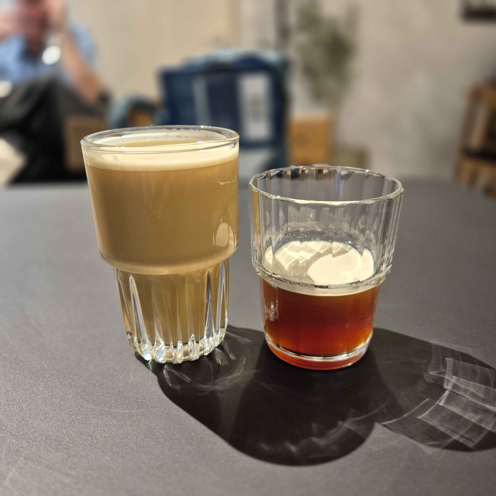

# 🧋 Sips & Bites 🍙 

---

## 🥤 **Nitro Sips**  
- **Nitro Cold Brew Coffee**
- **Nitro Cafe Latte**  (Fused with rice and almon milk)  
- **Nitro Cha Thai**  (Preferably with plant-based drinks)
- **Nitro Matcha Latte**  (Preferably with plant-based drinks)
- **Nitro Lemonade**  
- **+ Seasonal Nitro Drinks**  
\
   **🤔 Why Nitro?**  
   Our nitro-infused beverages are designed to captivate both the palate and the eye. By injecting nitrogen into each drink, we achieve a ***naturally creamy texture without additives, while the mesmerizing cascading effect turns every pour into a social media moment***. Nitrogen softens bitterness in coffee and tea while letting ingredients shine. These drinks cater to time-conscious customers while positioning the bar as a hub for innovative beverage experiences.  

---

## 🍣 **Savory Bites**  

### **American-Japanese Fusion**  
- **SPAM Musubi** (Teriyaki-glazed spam + nori-wrapped rice)
- **Tofu Musubi** (Vegan friendly option filled with umami)
- **Random Musubi** (Chef’s seasonal pick)  
- **Onigiri** (Rice balls: Tuna Mayo, Salmon, Umeboshi Plum)  
\
   **🤔 Why Fusion Bites?**  
   This category merges modernism with Japanese tradition.Musubi offers a savory, portable snack rooted in Hawaiian culture, while Onigiri—a Japanese staple—provides authentic fillings like umeboshi plum and tuna mayo. These items are designed for grab-and-go efficiency, requiring minimal prep during peak hours, and their use of traditional ingredients like nori and furikake ensures cultural authenticity.  

### **Comfort Classics**  
- **Ochazuke (お茶漬け)** (Steamed rice + toppings + green tea or dashi) 
- **Grilled Cheese Toast** (Cheddar, Gouda, Vegan Cheese)  
- **Today’s Soup** (Rotating: Miso, Tomato Basil, Lentil)  
\
   **🤔 Why Comfort Classics?**  
   Universal favorites like grilled cheese toast and rotating soups appeal to a broad audience, from families to office workers. The Mediterranean Wrap introduces a global twist with hummus and grilled veggies, catering to adventurous eaters without straying from familiar formats. Pairing soup with toast creates an easy upsell opportunity, while vegan cheese and veggie options ensure inclusivity for diverse dietary needs.  

---

## ✨ **Optional Add-Ons**  

### 🥂 **Alcohol**  
- **Local Craft Beer** (Rotating taps)  
- **Sparkling Wine** (By the glass)  
\
   **🤔 Why Alcohol?**  
   Alcohol is positioned as a strategic add-on, not a focus. Local craft beer and sparkling wine appeal to evening crowds seeking a relaxed vibe, requiring minimal storage or prep compared to a full bar. Curated pairings—like a hoppy IPA with spicy wraps—enhance the dining experience without complicating operations.  

### 🍦 **Sweet Treats**  
- **Soft Serve Ice Cream** (Matcha, Vanilla, Vegan Coconut)  
- **Portuguese Custard Tart** (Flaky pastry + cinnamon custard)  
- **Nitro Affogato** (Soft serve + nitro coffee shot)  
\
   **🤔 Why Optional Sweets?**  
   Desserts like matcha soft serve and Portuguese custard tarts serve as indulgent finishers or standalone treats. The Nitro Affogato—a hybrid of our core nitro coffee and creamy soft serve—bridges categories, creating a signature item. Vibrant colors and photogenic presentation make these sweets Instagram naturals, driving organic social buzz.  

### 🍜 **Quick Comfort**  
- **Global Cup Noodles** (Japanese Miso Ramen, Korean Kimchi Noodle, Vegan Curry Laksa)  
- **Toppings Bar** (Soft-boiled egg, scallions, chili oil)  
\
   **🤔 Why Cup Noodles?**  
   Global cup noodles offer a warm, comforting option with almost zero kitchen effort. Premium instant varieties like Japanese miso ramen or vegan laksa align with the café’s travel-inspired theme, while a toppings bar (soft-boiled eggs, chili oil) lets customers customize their bowl. Paired with nitro drinks, they create cozy combos perfect for rainy days or late-night cravings.  

---

**Final Note**  
*Sips & Bites* balances innovation with approachability. Nitro beverages and fusion bites drive the core menu, while optional add-ons—alcohol, sweets, and noodles—cater to niche cravings without operational strain. Every item serves a strategic purpose, from social media appeal to dietary inclusivity.  

