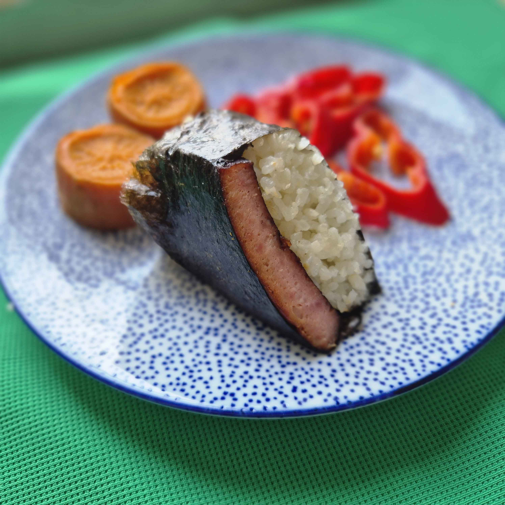

# 🧋 Sips & Bites 🍙 

---

## 🥤 **Nitro Sips**  
- **Nitro Cold Brew Coffee**
- **Nitro Barrel Aged Coffee** ([exempli gratia](asset/PXL_20220223_212155843.PORTRAIT.JPG))
- **Nitro Cafe Latte**  (Fused w/ rice and almond milk)  
- **Nitro Cha Thai**  (Preferably w/ plant-based drinks)
- **Nitro Matcha Latte**  (Preferably w/ plant-based drinks)
- **+ Seasonal Nitro Drinks**  
\
   **🤔 Why Nitro?**  
   Our nitro sips captivate both the palate and the eye. By injecting nitrogen into each drink, we achieve a ***naturally creamy texture without additives, while the cascading effect turns every pour into Instagram-ables***.

---

## 🍾 **Fizzy Sips**  
- **Fizzy Kombu茶** (Bubbles during fermentation or CO2 injection)
- **[飲み物]** 
- **Fizzy Lemonade**  (Infused w/ CO2)
- **+ Seasonal Fizzy Drinks**  
\
   **🤔 Why CO2?**  
   Because it's freaking refreshing!

---

## 🍣 **Savory Bites**  

### **European-Japanese Fusion**  
- **SPAM Musubi** (Teriyaki-glazed spam + nori-wrapped rice)
- **Tofu Musubi** (Vegan option filled with umami)
- **Random Musubi** (Chef’s seasonal pick)  
- **Onigiri** (Rice balls: Tuna Mayo, Salmon, Umeboshi Plum) 
- **Sushi Roll** 
- **Wanton Soup** \
\
   **🤔 Why Fusion Bites?**  
   This category merges modernism with Japanese tradition. These items are designed for grab-and-go efficiency, requiring minimal prep during peak hours, and their use of traditional methods and ingredients.

---

## ✨ **Optional Add-Ons**  

### 🥂 **Alcohol**  
- **Local Craft Beer** (Rotating taps)  
- **Sparkling Wine** (By the glass)
- **For Chr!st's Sake** (Sak.ee, Makko.li, Shoc.hu) \
\
   **🤔 Why Alcohol?**  
   Alcohol is positioned as a strategic add-on, not a focus. Local craft beer and sparkling wine appeal to evening crowds seeking a relaxed vibe, requiring minimal storage or prep compared to a full bar. 

### 🍦 **Sweet Treats**  
- **Soft Serve Ice Cream** (Matcha, Vanilla, Vegan Coconut)  
- **Portuguese Custard Tart** (Flaky pastry + cinnamon custard)  
- **Nitro Affogato** (Soft serve + nitro coffee shot)
- **Classic Affogato** (Geleto + Espresso)  \
\
   **🤔 Why Optional Sweets?**  
   Desserts like matcha soft serve and Portuguese custard tarts serve as indulgent finishers or standalone treats. The Nitro Affogato—a hybrid of our core nitro coffee and creamy soft serve—bridges categories, creating a signature item. 

### 🍜 **Quick Comfort**  
- **Global Cup Noodles** (Japanese Miso Ramen, Korean Kimchi Noodle, Vegan Curry Laksa)  
- **Toppings Bar** (Soft-boiled egg, scallions, chili oil)  
\
   **🤔 Why Cup Noodles?**  
   Global cup noodles offer a warm, comforting option with almost zero kitchen effort. 

---

**Final Note**  
*Sips & Bites* balances innovation with approachability. Nitro beverages and fusion bites drive the core menu, while optional add-ons—alcohol, sweets, and noodles—cater to niche cravings without operational strain. Every item serves a strategic purpose, from social media appeal to dietary inclusivity.  

[TODO]: # ADD [RØST](http://rost.ee/) PRODUCTS -› kream.ee x RØST
 
